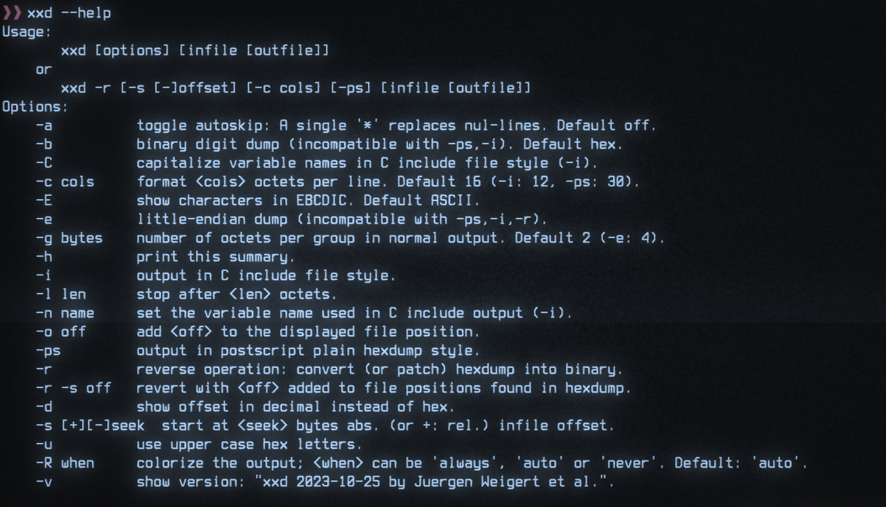

# CLI Syntax



This blog article is essentially a repost of a small summary about CLI syntax on Unix and Windows systems. Originally intended it as a chapter for the [cli-book](https://github.com/Nicoretti/cli-book) I wanted to write. Unfortunately, I never found enough time to keep working on it. However, I still aim to gather more information and knowledge regarding the Terminal, Shells, and various command line tools available. Therefore, I decided to try sharing this information one blog post at a time. Since CLI syntax is crucial for understanding and developing CLI tools, I thought it would be beneficial to share and update the content I had initially written for the book. 

Before you start reading this article you may consider reading the [POSIX Utility Conventions](http://pubs.opengroup.org/onlinepubs/9699919799/basedefs/V1_chap12.html). It is approximately a 10-20 minute read which will provide a solid base when it comes to CLIs and their syntax.

Let's get some content going:material-exclamation-thick:

## Terminology

If you read about `CLIs`, you will usually encounter specific terminology:
```
utility, command, subcommand, argument, option, flag, switch, operand
```
Still, the meanings may slightly differ depending on the source or context in which a term is mentioned. To ensure we are all on the same page regarding these terms, the table below describes the terms and their meanings in the context of this article and on this blog in general.

| Term                   | Meaning on this Blog                                            | Names in other Standards/Definitions |
|------------------------|----------------------------------------------------------------|--------------------------------------|
| command                | The CLI tool itself                                            | utility (Posix)                      |
| subcommand             | A subcommand of a command or of a command group                |                                      |
| argument (required/positional) | Required or Positional Argument                        | operand (Posix)                      |
| option                 | A setting with an additional argument/value (key-value pair)   | option (Posix)                       |
| switch                 | Like an option but with a set of mutually exclusive arguments/values  | option (Posix)                |
| options                | Superset of flags + switches + options                         | options (Posix)                      |

!!! note
    With the specification above, there is ambiguity regarding the term `options`. Here, options could mean either:

    * The plural of an option, a setting with an additional argument
    * `options`, the superset of `flags`, `switches`, and `option`

    Therefore, when referring to the plural of option, one should say "options of type option," and when referring to the superset of all `options`, `switches`, and `flags`, one should simply say "options."


Below, you will find an annotated help example of a CLI, demonstrating where and how the different terms and types find their place.


## Unix Syntax

| Symbol       | Element               | Description                                             |
|:------------:| ----------------------| ------------------------------------------------------- |
| `Text`       | text                  | Items you must type as shown                            |
| `TEXT`       | upper case text       | Placeholder for which you must supply a value           |
| `<name>`     | text in angle brackets| Placeholder for which you must supply a value           |
| `[]`         | bracket               | Optional items                                          |
| `{}`         | curly braces          | Set of mutually exclusive but required items, choose one|
| `()`         | braces                | Set of mutually exclusive but required items, choose one|
| `|`          | vertical bar          | Separates mutually exclusive items                      |
| `…`          | ellipsis              | Indicates that item (flag, option, argument, ...) can be repeated multiple times  |
| `-`          | dash                  | Indicates start of short option(s), if it stands alone it is often used as file argument parameter to specify stdin |
| `--`         | double dash           | Indicates the start of a long option or if not followed by an option name it indicates the end of the CLI arguments for the command  |

## Windows Syntax

| Symbol       | Element               | Description                                                  |
|:------------:| ----------------------| ------------------------------------------------------------ |
| `Text`         | Text | Items you must type as shown                         |
| `<Text>`     | Text inside angle brackets | Placeholder for which you must supply a value         |
| `[Text]`     | Text inside square brackets | Optional items                                        |
| `{Text}`     | Text inside braces | Set of required items. You must choose one            |
| `|`          | Vertical bar | Separator for mutually exclusive items. You must choose one |
| `…`          | Ellipsis | Items that can be repeated and used multiple times              |

The original source for the table above can be found [here](https://docs.microsoft.com/en-us/windows-server/administration/windows-commands/command-line-syntax-key).

## Examples

### Usage Examples

| Element                       | Example(s)                                                                 |
| ----------------------------- | -------------------------------------------------------------------------- |
| Required/Positional Arguments | `ARGUMENT`, `<argument>`, `<ARGUMENT>`                                           |
| Option with value             | `--option=value`, `--option=VALUE`, `--option <value>`, `--option=<value>`, `--option value`, `--option VALUE` |
| Switch                        | `--light={on | off}`, `--power {up | down}`                                     |
| Flag                          | `--track`, `--verbose`, `-V`                                                     |
| Optional Items                | `--track`, `--verbose`, `-V`, `[<argument>]`                                     |
| Mutually-Exclusive & Required | `(--track | --no-track)`, `<FILE> | <PATH>`                                      |
| End of passing CLI arguments  | `user@host ~$ cli foo -b --this -- other args`                                   |
| Repeating Elements            | `<argument>...`                                                                  |

### Annotated Example Help

!!! note "Note: Everything following `#` is a comment"

```console
Short description what this command does

usage:

cmd [flags] [options] <username> <password>

arguments:
    <username>  which shall be used for the login             # 1. required/positional-argument
    <password>  associated with the specified username        # 2. required/positional-argument

flags:
    -f, --force                 execute action anyway         # 5. flag
    -h, --help                  show this help message        # 6. flag

options:
    -i <file>, --input <file>   file which shall be processed # 3. option
    -s <unit>, --speed <unit>   mph, kmh  [default: mph]      # 4. switch
```


## References & Resources

* [POSIX Utility Conventions](http://pubs.opengroup.org/onlinepubs/9699919799/basedefs/V1_chap12.html)
* [Windows Command-Line Syntax](https://docs.microsoft.com/en-us/windows-server/administration/windows-commands/command-line-syntax-key)

!!! Note

    [Git](https://git-scm.com/) is an excellent resource for finding usage examples, seeing the CLI syntax in action, and understanding the nuances (it is well-documented, and there are plenty of answers available on Stack Overflow & Co.). If you ever get stuck figuring out how to structure your CLI, I recommend browsing through some [Git commands](https://git-scm.com/docs).

