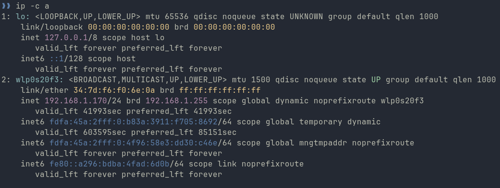

# Daily Dose Of CLI \#1

## Quickly Spot Your IP-Addresses

```shell
ip -c a
```



!!! Tip "Kudos"

    Kudos to :simple-github: [weinshec](https://github.com/weinshec) for pointing out that `a` also references the `address` object.

### References
* [`man 8 ip`](https://linux.die.net/man/8/ip)


