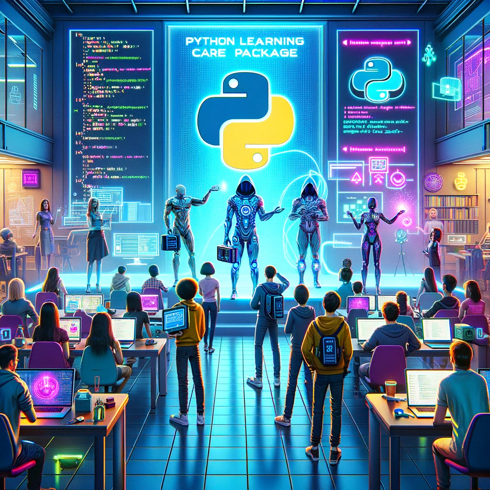

# The Learning Python Care Package

Over the past year, I've been approached by numerous individuals seeking recommendations for good Python learning resources.
So I've decided to compile a somewhat comprehensive list in form of this article. Making it easier for me to share, by simply directing people here.
If you've send here by me, I hope these resources meet your needs. If not, please let me know!

## Book(s)

### [Fluent Python](https://www.amazon.com/Fluent-Python-Concise-Effective-Programming/dp/1491946008){:target="_blank"}

Once you've moved past the very basics (syntax, etc.), this book stands out as the best, in my opinion.
Recently, the [second edition](https://www.oreilly.com/library/view/fluent-python-2nd/9781492056348/){:target="_blank"} of this book was published.
Despite owning a hard copy, I haven't had the time to read it yet. A short disclaimer: while the first edition is quite substantial, it's still a manageable size for reading as a physical book. However, the same can't be said for the second edition; it's quite hefty, making it more suitable for electronic reading.

*(Best Python book in my humble opinion)*

### [Pytest-Book](https://pythontest.com/pytest-book/){:target="_blank"}

In my view, pytest is the go-to unit testing framework/library for Python.
While I generally advocate for minimizing dependencies, especially when the Python standard library offers robust solutions,
it's hard to argue against pytest. Once you grasp its potential and advantages, it is impossible to not go for it.

This book is an excellent resource for testing, particularly with pytest. I highly recommend it for anyone looking to delve deeper into testing and harnessing the power of pytest.

## Online Courses

### [Talk Python to Me Courses](https://training.talkpython.fm/courses/all){:target="_blank"}

These courses are nicely crafted with love and passion, suitable for beginners to intermediate learners (depending on the topic).
The ownership (lifetime access model) is highly appreciated in this world of `subscription #%^*@-#`.
A nice side effect is also that it supports [Talk Python To Me](https://talkpython.fm){:target="blank_"} and Co.
Beginners should definitely explore the courses offered here.

### Pluralsight Courses by [Austin Bingham](https://www.pluralsight.com/authors/austin-bingham){:target="_blank"} and [Robert Smallshire](https://www.pluralsight.com/authors/robert-smallshire){:target="_blank"}

Both authors offer great courses packed with valuable information and are well-crafted. For those inclined towards reading, they have three books catering to different experience levels, covering similar ground:

- [The Python Apprentice](https://leanpub.com/python-apprentice){:target="_blank"}
- [The Python Journeyman](https://leanpub.com/python-journeyman){:target="_blank"}
- [The Python Master](https://leanpub.com/python-master){:target="_blank"}

While I haven't read these books personally, judging from their video courses, they are likely to be of high standard.

*Side Note (for Intermediate learners): You may find it beneficial to watch the videos at 1.2 - 1.4x speed, pausing or slowing down at the more "interesting" sections.*

## Programming Puzzles and Exercises

While preferences for programming puzzles and exercises vary greatly among individuals 
(personally, I lean towards creating small CLI applications for various purposes), I've also done some puzzles here and there.
Below, you'll find a fairly standard list of Python puzzles and exercises that might be interesting to some of you.

- [CheckiO](https://checkio.org/){:target="_blank"}
- [Exercism](https://exercism.org){:target="_blank"}
- [Python Mastery Exercises](https://github.com/dabeaz-course/python-mastery/blob/main/Exercises/index.md){:target="_blank"}

## Idioms

Inspired by [this gist](https://gist.github.com/0x4D31/f0b633548d8e0cfb66ee3bea6a0deff9){:target="blank_"} I started collecting
python idioms [here](https://exasol.github.io/python-styleguide/guides/idioms/idioms.html){:target="blank_"}.

## Podcasts

### [Python Bytes](https://pythonbytes.fm){:target="_blank"}

**`Python headlines dilivered directly to your earbuds`**

Python Bytes is an entertaining weekly podcast of roughly 30 minutes.
It's fantastic for getting quick updates and discovering new ideas (such as blog posts, new libraries, and frameworks) within the Python space.

Although it's a podcast, the episodes are also live-streamed, allowing listeners to engage in a live chat during the show.

### [Talk Python To Me](https://talkpython.fm){:target="_blank"}

**`A podcast on Python and related technologies`**

While the above description is accurate, it understates the true value of this podcast. 

**My personal TL;DR would be:** 

    An excellent ~60-minute podcast covering various detailed Python-related topics.

While not every episode might align with one's specific interests, they are consistently enjoyable to listen to.
Alongside `Python Bytes`, this podcast offers an ideal way for staying updated on on Python and its community.

## Talks

### [Stop Writing Classes](https://youtu.be/o9pEzgHorH0?si=efYB_vU5bW-yvKsV) by [Jack Diederich](https://github.com/jackdied)

TL;DR: `Old but Gold!!`

### [Transforming Code into Beautiful, Idiomatic Python](https://www.youtube.com/watch?v=OSGv2VnC0go) by [Raymond Hettinger](https://github.com/rhettinger)
TL;DR: `Must watch talk on how to improve your python code.`

### [Refactoring Python: Why and how to restructure your code](https://youtu.be/D_6ybDcU5gc?si=5f7nbKJVM19pnn-3) by [Brett Slatkin](https://github.com/bslatkin)
TL;DR: `Must watch talk on how to go about refacotring in python.`

### [Modern Dictionaries](https://youtu.be/p33CVV29OG8?si=iPNPWVqFx3mo5RtX) by [Raymond Hettinger](https://github.com/rhettinger)
TL;DR: `An interesting and insightful deep dive into dictionaries.`

