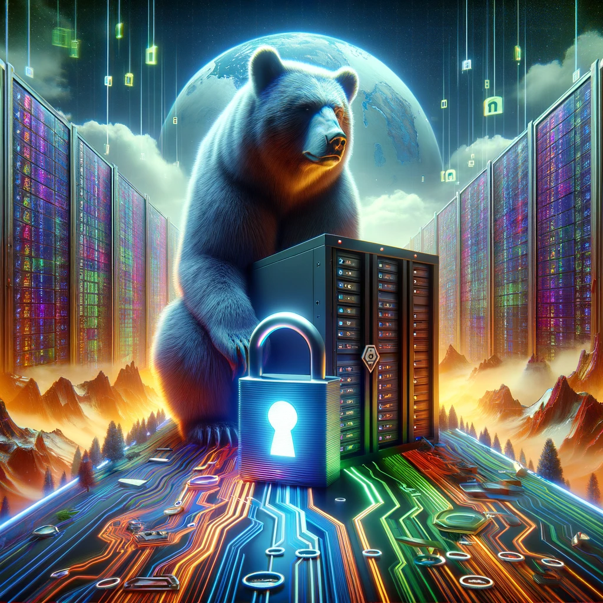

# Remote Unlocking Encrypted Linux System Partition

:material-information-outline:{ title="Craft an image of a server and its data disk under the vigilant protection of a formidable bear, symbolizing an unbreakable lock, all set within a vivid digital realm. The path to this secure server is a digital highway, encrypted with cryptic data, emphasizing the fortified access against unauthorized intrusion, with the entire scenery unfolding in a visually rich, digital landscape." } *Image created by DALL-E, OpenAI's image generation model.*

### TL;DR

Unlocking encrypted root partion of a Debian based system (Ubuntu 22.04) via ssh.

* Install `dropbear-initramfs` package
* Adjust configuration `/etc/dropbear/initramfs/dropbear.conf`
* Create or add key to `/etc/dropbear/initramfs/authorized_keys`
* Update the `initramfs`: `sudo update-initramfs -u`
* Reboot `sudo systemctl reboot`
* Connect to the booting machine (`ssh root@<host>`) and unlock the encrypted partion using `cryptroot-unlock`

## Background

I recently ventured back into the realm of server management, setting up a basic home server and opting for a hosting provider to manage some services myself. While encrypting the drives of laptops or desktops is generally accepted and straightforward, applying similar security measures to a server—especially one you don't physically access—might not seem as obvious or easy to everyone. Before diving deeper, let me clarify two key points.

### Why Encrypt Your Server Disk?

The rationale behind encrypting a server disk might vary, but there are two primary benefits I believe make it indispensable:

- **Data Erasure Security:** Ensuring that data is irrecoverable when I choose to delete it helps maintain online privacy and security. It's about making sure that the internet has the ability to "forget."
- **Protection Against Unauthorized Access:** Encrypting the disk offers a fundamental layer of security against potential theft or unauthorized access to the disk storage by the hosting provider or others.

**Disclaimer:** It's crucial to recognize that lacking physical control over the machine introduces additional attack vectors,
potentially reducing some of the security guarantees. However, in my opinion, the benefits of disk encryption still outweigh the effort.

## Compatibility and System Requirements

This walkthrough is tailored for Debian-based systems, specifically highlighting **Ubuntu 22.04**.
Although the general workflow should be consistent, package names and paths may differ across distributions and versions.

!!! note "Note: Fedora and Dracut Users"

    For those using Fedora or systems that employ Dracut, a similar setup can be achived using Dracut and [dracut-crypt-ssh](https://github.com/dracut-crypt-ssh/dracut-crypt-ssh).

### Links & Resources
Below are links and resources I've consulted while setting up and figuring out my personal setup.
Since preferences vary, you might find some of these resources more suited for your needs or maybe they
provide you some additional insights.

* [Dropbear SSH](https://matt.ucc.asn.au/dropbear/dropbear.html)
* [Package: dropbear-initramfs](https://packages.ubuntu.com/jammy/dropbear-initramfs)
* [dropbear(8)](https://manpages.ubuntu.com/manpages/jammy/en/man8/dropbear.8.html)
* [cryptsetup(8)](https://manpages.ubuntu.com/manpages/jammy/en/man8/cryptsetup.8.html)
* [dcracut-crypt-ssh](https://github.com/dracut-crypt-ssh/dracut-crypt-ssh)
* [ceremcem/unlock-luks-partition](https://github.com/ceremcem/unlock-luks-partition)
* [Remotely unlock a LUKS-encrypted Linux server using Dropbear (Debain 12)](https://www.dwarmstrong.org/remote-unlock-dropbear/)
* [UNLOCKING A LUKS FULLY ENCRYPTED DRIVE AND BOOTING INTO THE OS VIA DROPBEAR](https://swissmade.host/en/blog/unlocking-a-luks-fully-encrypted-drive-and-booting-into-the-os-via-dropbear-ssh)
* [How to unlock LUKS using Dropbear SSH keys remotely in Linux](https://www.cyberciti.biz/security/how-to-unlock-luks-using-dropbear-ssh-keys-remotely-in-linux/)

