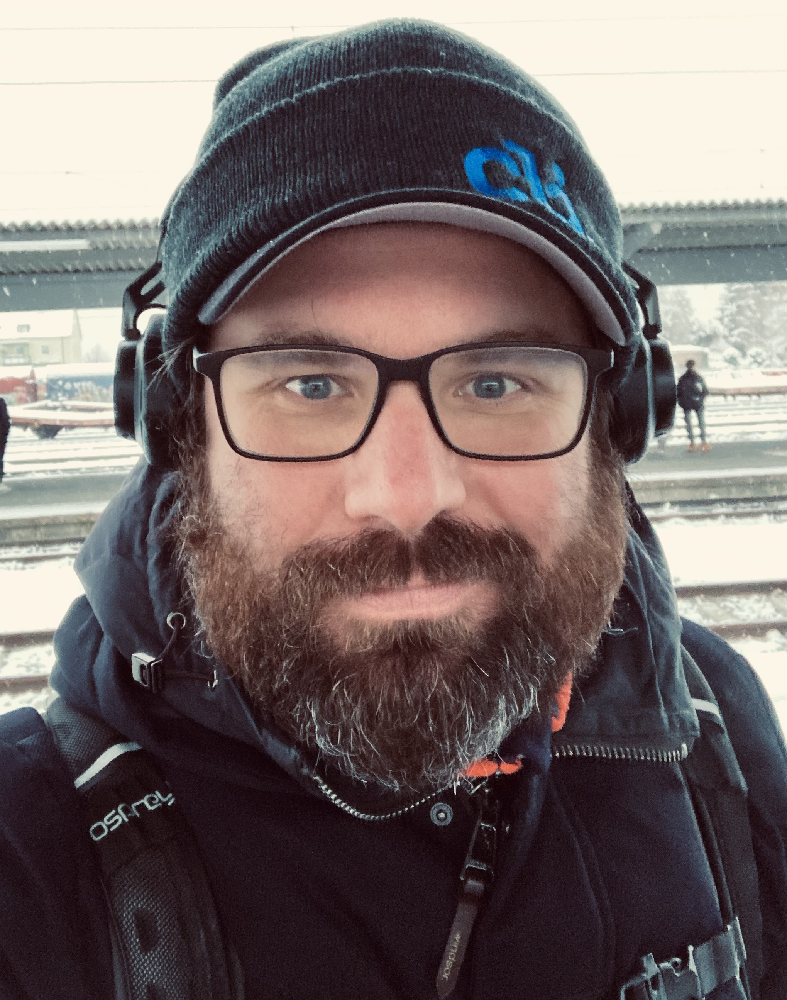

# Home

## About Me

### Hi, my name is Nico

I am half Italian and half German, sadly don't really speak Italian though.
Still, growing up and seeing two different cultures, their actions and their impact is a great gift I was lucky to receive.

I would describe myself as a communicative, extroverted person, who likes to share his knowledge and loves to work with other people.
I love to teach and mentor but also enjoy and appreciate being taught.

One of my major personal missions is, to help people realize and tap 
into the power of **:octicons-command-palette-16: Command Line Tools** and the **:octicons-terminal-16: Terminal** in general.

For some more details on my personal mindset checkout my [User Manual :material-bookshelf:](user-manual.md).

